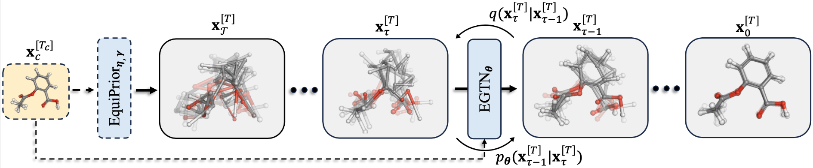

# Geometric Trajectory Diffusion Models (NeurIPS 2024)

**Jiaqi Han, Minkai Xu, Aaron Lou, Haotian Ye, Stefano Ermon**

**Stanford University**

[](https://github.com/hanjq17/GeoTDM/blob/main/LICENSE)
[](https://arxiv.org/abs/2410.13027)


## Introduction

We introduce Geometric Trajectory Diffusion Models (**GeoTDM**), a generative model that captures the distribution of geometric trajectories, i.e., the temporal evolution of a geometric system.
GeoTDM extends geometric diffusion models from static states to temporal dynamics by directly modeling the joint distribution of a sequence of frames.
More importantly, GeoTDM features an SE(3)-equivariant spatio-temporal graph neural network and a carefully designed prior parameterization, enabling the preservation of physical symmetry and expressive distribution modeling.

GeoTDM demonstrates strong performance in modeling geometric trajectories across various domains, including, e.g., molecular dynamics, physical simulation, and pedestrian trajectory forecasting, in both unconditional and conditional generation settings.



## Dependencies
We use `python==3.8.18` for our experiments with the following core packages:
```
torch==1.13.0
torch-geometric==2.4.0
scikit-learn==1.3.2
networkx==3.1
pandas==2.0.3
einops==0.7.0
```
Other packages like `wandb`, `torch-scatter`, `torch-sparse`, `torch-kmeans` are also recommended to install for full functionality.

## Experiments

### Physical Simulation

#### Data Generation
Generate the dataset by running `gen_data.sh` under `datasets/datagen` folder.

#### Conditional Generation
Training, inference, and evaluation (all in one script):
```python
python -m torch.distributed.launch \
    --nproc_per_node=4 \
    --master_port 16888 \
    experiments/nbody_train.py \
    --train_yaml_file configs/nbody_train_cond.yaml
```

By default, we use 4 GPUs for training. You can change the number of GPUs by modifying `--nproc_per_node`.
You can also enable `wandb` to monitor training by changing `no_wandb` to `False` in the config file.

#### Unconditional Generation
Training:
```python
python -m torch.distributed.launch \
    --nproc_per_node=4 \
    --master_port 16888 \
    experiments/nbody_train.py \
    --train_yaml_file configs/nbody_train_uncond.yaml
```
Inference:
```python
python experiments/nbody_sampling.py --eval_yaml_file configs/nbody_sampling.yaml
```
Evaluation:
```python
python -m experiments.scores --path outputs/nbody_GeoTDM_uncond_eval/samples.pkl
```


### Molecular Dynamics

#### Data Preparation
Download the MD17 dataset in `.npz` format from [here](http://www.sgdml.org/#datasets). The dataset should be placed in `data/md17`.

#### Conditional Generation
Training, inference, and evaluation (all in one script):
```python
python -m torch.distributed.launch \
    --nproc_per_node=4 \
    --master_port 16888 \
    experiments/md17_train.py \
    --train_yaml_file configs/md17_train_cond.yaml
```

#### Unconditional Generation
Training:
```python
python -m torch.distributed.launch \
    --nproc_per_node=4 \
    --master_port 16888 \
    experiments/md17_train.py \
    --train_yaml_file configs/md17_train_uncond.yaml
```
Inference:
```python
python experiments/md17_sampling.py --eval_yaml_file configs/md17_sampling.yaml
```
Evaluation:
```python
python -m experiments.scores --path outputs/md17_aspirin_GeoTDM_uncond_eval/samples.pkl --chem
```

### Pedestrian Trajectory Forecasting

#### Data Preparation
Follow the instructions [here](https://github.com/MediaBrain-SJTU/EqMotion?tab=readme-ov-file#data-preparation-3) to download and preprocess the data.
Then move the preprocessed files in the folder `processed_data_diverse` into `data/eth`.

#### Conditional Generation
Training, inference, and evaluation (all in one script):
```python
python -m torch.distributed.launch \
    --nproc_per_node=4 \
    --master_port 16888 \
    experiments/eth_train_new.py \
    --train_yaml_file configs/eth_train_new.yaml
```

## Generated Samples


## Citation
Please consider citing our work if you find it useful:
```
@article{han2024geometric,
  title={Geometric trajectory diffusion models},
  author={Han, Jiaqi and Xu, Minkai and Lou, Aaron and Ye, Haotian and Ermon, Stefano},
  journal={Advances in Neural Information Processing Systems},
  volume={37},
  pages={25628--25662},
  year={2024}
}
```

## Contact

If you have any question, welcome to contact me at:

Jiaqi Han: jiaqihan@stanford.edu


## Acknowledgment

This repo is built upon several great codebases, including [guided diffusion](https://github.com/openai/guided-diffusion) and [EqMotion](https://github.com/MediaBrain-SJTU/EqMotion). We thank the authors for their great work and open-sourcing the code.
